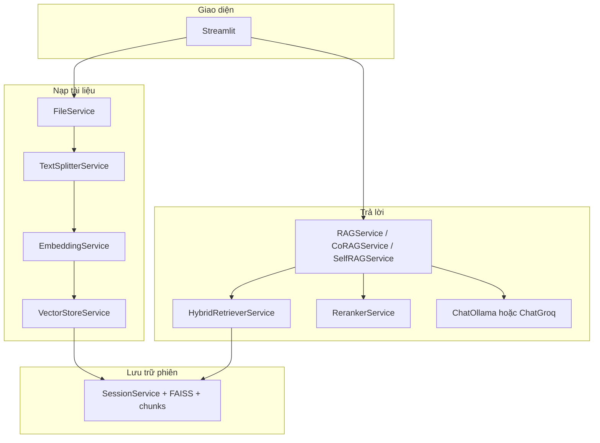

# Kiến trúc tổng quát — Vietnamese RAG Assistant

Tài liệu mô tả **luồng dữ liệu** và **thư viện** dùng trong dự án (theo mã nguồn `app/` và `requirements.txt`).

---

## 1. Tổng quan

Ứng dụng **Streamlit** cho phép tải tài liệu (PDF, ảnh, DOCX), trích văn bản, **chunk hóa**, **nhúng vector**, lưu chỉ mục **FAISS**, rồi trả lời câu hỏi bằng **LLM** (Ollama hoặc Groq) kèm **trích dẫn**. Có thể bật **truy vấn hybrid** (BM25 + vector), **rerank** (Cross-encoder), và các chế độ **RAG / Co-RAG / Self-RAG**.

---

## 2. Giao diện và trạng thái

| Thành phần | Thư viện / gói | Vai trò |
|------------|----------------|--------|
| Web UI | **Streamlit** | Trang chính, sidebar (upload, cài đặt chunk / retrieval), chat |
| Phiên làm việc | **Streamlit** `session_state` + **SessionService** | Lưu file đã xử lý, vector store FAISS, lịch sử chat, filter tài liệu |
| Lịch sử hội thoại | **langchain_community** `ChatMessageHistory`, **langchain_core** messages | Context cho chuỗi RAG có lịch sử |

---

## 3. Xử lý tài liệu (ingest)

| Bước | Module | Thư viện | Ghi chú |
|------|--------|----------|---------|
| PDF (text) | `FileService._process_pdf` | **pdfplumber** | Trích text theo trang; ghi nhận offset trang (`page_ranges`) |
| PDF (scan / trang trống) | `FileService` + `pdf_convert` | **pdf2image** (Poppler), **Pillow** (PIL), **pytesseract** | Ảnh từng trang → OCR Tesseract (`vie+eng`) |
| DOCX | `FileService._process_doc` | **python-docx** (`import docx`) | Ghép đoạn văn thành một chuỗi |
| Ảnh upload | `FileService._process_image` | **Pillow**, **pytesseract** | OCR qua `TesseractOCRWrapper` |
| Log | `app.utils.logger` | **loguru** | |

**Ghi chú dependencies:** `requirements.txt` còn khai báo **PyMuPDF**, **opencv-python** — hiện không thấy import trực tiếp trong `app/`; có thể dùng cho script phụ hoặc mở rộng sau.

---

## 4. Chunk và metadata

- API cắt văn bản: [TEXT_SPLITTER.md](./TEXT_SPLITTER.md)
- Khái niệm chunk, metadata, `all_chunks` vs FAISS: [CHUNK.md](./CHUNK.md)

| Thành phần | Thư viện | Chi tiết |
|------------|----------|----------|
| Chia văn bản | **langchain-text-splitters** → `RecursiveCharacterTextSplitter` | `TextSplitterService`: kích thước / overlap từ `AppConfig` hoặc session |
| Chunk có offset & trang | Cùng splitter với `add_start_index` / `split_with_offsets` | Map ký tự → số trang khi có `page_ranges` từ PDF |

---

## 5. Embedding và vector store

- Nhúng vector & `HuggingFaceEmbeddings`: [EMBEDDING.md](./EMBEDDING.md)
- FAISS, `VectorStoreService`, nối index, xóa index: [VECTOR.md](./VECTOR.md)

| Thành phần | Thư viện | Chi tiết |
|------------|----------|----------|
| Embedding | **langchain-huggingface** `HuggingFaceEmbeddings` | Model mặc định: `sentence-transformers/paraphrase-multilingual-mpnet-base-v2` (`AppConfig.EMBEDDING_MODEL_NAME`) |
| Nền tính toán | **sentence-transformers**, **transformers**, **torch** | CPU wheel trong `requirements.txt` |
| Vector DB | **langchain_community.vectorstores.FAISS** + **faiss-cpu** | `VectorStoreService.build_from_chunks` tạo `Document` + metadata (`source`, `chunk_id`, `page`, …) |

---

## 6. Truy vấn (retrieval)

- BM25 + FAISS (`HybridRetrieverService`): [HYBRID_RETRIEVER.md](./HYBRID_RETRIEVER.md)
- Cross-encoder rerank (BGE reranker, tùy chọn): [RERANK.md](./RERANK.md)

| Chiến lược | Thư viện | Module |
|------------|----------|--------|
| Chỉ vector (FAISS similarity) | LangChain retriever trên FAISS | `RAGService` / cấu hình sidebar |
| Hybrid BM25 + FAISS | **langchain_community** `BM25Retriever`, `EnsembleRetriever`; từ khóa qua **rank_bm25** | `HybridRetrieverService` — trọng số BM25/vector lấy từ session |
| Rerank | **sentence_transformers** `CrossEncoder` — model `BAAI/bge-reranker-v2-m3` | `RerankerService` (cache Streamlit khi có) |

---

## 7. Sinh câu trả lời (LLM và chuỗi)

Pipeline **RAG Only** (retrieve, trích dẫn `[n]`, hai hàm `get_answer*`): [RAG.md](./RAG.md).

| Thành phần | Thư viện | Chi tiết |
|------------|----------|----------|
| LLM cục bộ | **langchain_community** `ChatOllama` | Cấu hình `OLLAMA_LLM_MODEL` (mặc định `qwen2.5:7b`) |
| LLM API | **langchain-groq** `ChatGroq` | `GROQ_API_KEY`, `GROQ_LLM_MODEL` |
| Chuỗi RAG cổ điển | **langchain** `create_history_aware_retriever`, `create_retrieval_chain`, `create_stuff_documents_chain`; **langchain_core** prompts, `RunnableWithMessageHistory` | `RAGService` |
| Co-RAG / pipeline phức tạp | **langchain_core** `Runnable*`, `LLMChain`, parsers | `CoRAGService` |
| Self-RAG (rewrite, chấm điểm relevance, vòng lặp) | Tương tự + prompt templates | `SelfRAGService` |

Cấu hình provider: biến môi trường `LLM_PROVIDER` = `ollama` hoặc `groq` (`AIConfig`).

---

## 8. Các chế độ trả lời (tóm tắt)

- **RAG Only** / **Co-RAG** / **RAG & Co-RAG** / **Self-RAG** — định nghĩa thứ tự và nhãn trong `AppConfig.ANSWER_MODE_*`; logic tương ứng trong `rag_service`, `co_rag_service`, `self_rag_service`.
- Pipeline **Co-RAG** (sub-query, gom kết quả, tổng hợp có trích dẫn): [CO_RAG.md](./CO_RAG.md).
- Pipeline **Self-RAG** (rewrite, chấm relevance, self-eval, multi-hop tùy conf.): [SELF_RAG.md](./SELF_RAG.md).
- Mô hình trích dẫn: `app.models.citation` (`Citation`, `AnswerWithCitations`). Chi tiết luồng dữ liệu và bảng trường: [CITATION.md](./CITATION.md).

---

## 9. Bảng tham chiếu nhanh: thư viện → vai trò

| Thư viện | Vai trò trong hệ thống |
|----------|------------------------|
| **streamlit** | UI, session |
| **langchain** / **langchain_core** / **langchain_community** | Chuỗi RAG, retriever, FAISS, Ollama chat, BM25, lịch sử |
| **langchain-huggingface** | `HuggingFaceEmbeddings` |
| **langchain-groq** | Groq LLM |
| **langchain-text-splitters** | `RecursiveCharacterTextSplitter` |
| **sentence-transformers** / **transformers** / **torch** | Embedding + CrossEncoder reranker |
| **faiss-cpu** | Lưu vector, similarity search |
| **rank_bm25** (dùng qua LangChain) | Hạng từ khóa cho hybrid |
| **pdfplumber** | Trích text PDF |
| **pdf2image** + **Pillow** | PDF → ảnh trang (OCR) |
| **pytesseract** | OCR (cần binary Tesseract trên máy) |
| **python-docx** | Đọc DOCX |
| **python-dotenv** | `AIConfig` load `.env` |
| **pydantic** | Mô hình dữ liệu (citation, …) |
| **loguru** | Ghi log |

---

## 10. Chạy ứng dụng

Ứng dụng khởi tạo từ `app/main.py`: `SessionService.initialize()` → giao diện Streamlit (`app/ui/`). Cấu hình chunk mặc định: `AppConfig.CHUNK_SIZE`, `CHUNK_OVERLAP`.

---

*Tài liệu phản ánh cấu trúc tại thời điểm ghi. Khi thêm thư viện hoặc đổi pipeline, nên cập nhật bảng và sơ đồ tương ứng.*
