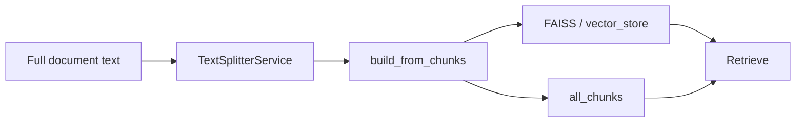

# Chunk — khái niệm, metadata và vòng đời trong hệ thống

Tài liệu mô tả **chunk là gì** trong RAG này, **hai dạng dữ liệu trước khi index**, **metadata trên `Document`**, **lưu session** (`all_chunks`), và **mối liên hệ với truy vấn / trích dẫn**.

## Chunk là gì?

**Chunk** là một **đoạn văn bản ngắn** (thường vài trăm đến vài nghìn ký tự) được tách từ nội dung tài liệu đầy đủ sau bước **Text splitting**. Mỗi chunk:

- Được **embed** thành vector và lưu trong **FAISS** (semantic search);
- Được giữ thêm bản **text thuần** trong session (`all_chunks`) để **BM25** dùng khi bật **hybrid retrieval**;
- Khi được chọn làm context, xuất hiện trong **citation** (trang, offset, `chunk_id`, …).

Kích thước / overlap do người dùng cấu hình (sidebar) hoặc mặc định `AppConfig.CHUNK_SIZE` / `CHUNK_OVERLAP` — xem [TEXT_SPLITTER.md](./TEXT_SPLITTER.md).

## Từ text thô → hai dạng chunk đầu vào

Sau `TextSplitterService`:

| Dạng | Kiểu Python | Nội dung |
|------|-------------|----------|
| **Không offset** | `List[str]` | Mỗi phần tử là toàn bộ nội dung một chunk. |
| **Có offset & trang** | `List[dict]` | `text`, `start`, `end`, `page` (tùy) — từ `split_with_offsets`. |

[`VectorStoreService.build_from_chunks`](../app/services/vector_store_service.py) chấp nhận **cả hai**; với từng phần tử nó tạo một `langchain_core.documents.Document` với `page_content` = nội dung chunk.

## Metadata trên mỗi `Document` (FAISS + citation)

Khi gọi `build_from_chunks`, mọi trường chung từ tham số `metadata` (ví dụ `source`, `document_id`, `file_type`, `uploaded_at`, …) được gộp vào từng doc. Per chunk, code gắn thêm:

| Trường | Ý nghĩa |
|--------|---------|
| `chunk_id` | **Chỉ số 0, 1, 2, …** trong lần gọi `build_from_chunks` **cho một tài liệu** (một lô chunk). Có thể trùng số giữa các tài liệu khác nhau; cần kết hợp `document_id` / `source` để phân biệt. |
| `char_start` / `char_end` | Ký tự bắt đầu / kết thúc trong full text, nếu chunk dict có `start` / `end`. |
| `page` | Số trang ước lượng từ `page_ranges`, nếu có. |
| Các trường từ `metadata` gốc | Thông tin tài liệu (tên file, `document_id`, …). |

Các trường `None` được lọc bỏ trước khi tạo `Document`.

## Hai lưu trữ song song: `vector_store` và `all_chunks`

| Cơ chế | Mục đích |
|--------|-----------|
| **`SessionService.vector_store`** | Đối tượng **FAISS** (LangChain): similarity search theo **vector embedding**. |
| **`SessionService.all_chunks`** | Danh sách tất cả `Document` đã index (nối dần qua `add_chunks`) — dùng build **BM25** khi `HybridRetrieverService` cần từ khóa. |

Mỗi lần `build_from_chunks` thành công:

1. Cập nhật / nối FAISS;
2. `SessionService.add_chunks(docs)` **append** các `Document` vừa tạo vào `all_chunks`.

Khi **xóa vector store** (Danger Zone / re-index từ đầu), thường gọi `VectorStoreService.clear()` → xóa cả FAISS và `all_chunks` cho đồng bộ.

**Lưu ý:** `chunk_id` trên mỗi tài liệu là local theo từng lần build; tổng số phần tử trong `all_chunks` bằng tổng số chunk đã từng thêm, không phải một ID toàn cục duy nhất.

## Retrieval và chunk

- **Top-K / per_source_k** (sidebar, `SessionService.get_retrieval_params`) giới hạn **số chunk** lấy từ semantic (+ hybrid/rerank).
- Các pipeline (`RAGService`, `CoRAGService`, …) map `Document` → [`Citation`](../app/models/citation.py) với `chunk_id` và offset lấy từ `metadata` — xem [CITATION.md](./CITATION.md).
- Giao diện (expander nguồn) hiển thị `chunk #…` nếu có `chunk_id` — [chat_display.py](../app/ui/components/chat_display.py).

## Sơ đồ vòng đời (rút gọn)

Nhúng vector: [EMBEDDING.md](./EMBEDDING.md). Chỉ mục FAISS & `VectorStoreService`: [VECTOR.md](./VECTOR.md).

## Tài liệu liên quan

| Chủ đề | File |
|--------|------|
| Cách cắt văn bản, `split` / `split_with_offsets` | [TEXT_SPLITTER.md](./TEXT_SPLITTER.md) |
| Embed + FAISS | [EMBEDDING.md](./EMBEDDING.md) |
| Vector store (FAISS, `build_from_chunks`, xóa index) | [VECTOR.md](./VECTOR.md) |
| Hybrid BM25 + vector (dùng `all_chunks`) | [HYBRID_RETRIEVER.md](./HYBRID_RETRIEVER.md) |
| Citation, `chunk_id` trong trả lời | [CITATION.md](./CITATION.md) |
| Tổng thể | [ARCHITECTURE.md](./ARCHITECTURE.md) |
