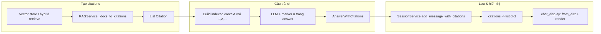

# Module `app.models.citation` — Citation & AnswerWithCitations

Tài liệu mô tả **mục đích**, **cấu trúc dữ liệu** và **các nơi sử dụng** trong dự án RAG (trích dẫn theo chunk/tài liệu, marker `[n]` trong câu trả lời).

## Mục đích

| Class | Vai trò |
|--------|--------|
| `Citation` | Một **nguồn trích dẫn** tương ứng với một chunk (hoặc đoạn) đã đưa vào context cho LLM: tên file, trang, offset, nội dung đầy đủ, điểm liên quan, và chỉ số tham chiếu **`[n]`** thống nhất với câu trả lời. |
| `AnswerWithCitations` | **Gói kết quả** từ pipeline RAG / Co-RAG / Self-RAG: chuỗi câu trả lời + danh sách `Citation` + `mode` (và trường bổ sung cho Self-RAG: confidence, điểm đánh giá, số hop). |

Hệ thống dùng mô hình: LLM trả lời với **inline citation** dạng `[1]`, `[2]`, … trùng với `ref_index` trên từng `Citation` sau khi retrieve và build context (xem `RAGService` / `CoRAGService` / `SelfRAGService`).

## `Citation` — các trường chính

| Trường | Ý nghĩa |
|--------|---------|
| `source_name` | Tên tài liệu (file) hiển thị cho user. |
| `document_id` | ID trong session, dùng để tải PDF tương ứng ở UI. |
| `page_number` | Trang (1-based) nếu có metadata từ PDF. |
| `char_start` / `char_end` | Offset ký tự trong full text. |
| `chunk_id` | Thứ tự chunk khi build vector store. |
| `relevance_score` | 0..1, độ gần semantic (sau chuẩn hóa từ distance / rank). |
| `excerpt` | Đoạn rút gọn (preview) khi cần list ngắn. |
| `full_text` | Toàn bộ nội dung chunk đưa vào prompt. |
| `ref_index` | Số `[n]` khớp với marker trong câu trả lời. |

**API hữu ích**

- `display_title()`: chuỗi tiêu đề (có `[n]`, tên file, trang).
- `to_dict()` / `from_dict()`: (de)serialize — **bắt buộc** khi lưu vào `st.session_state` vì Streamlit không giữ object tùy ý ổn định qua rerun; UI khôi phục bằng `Citation.from_dict`.
- `__hash__` / `__eq__`: gom trùng nguồn theo `(source_name, document_id, chunk_id, char_start)`.

## `AnswerWithCitations` — trường bổ sung

| Trường | Dùng khi nào |
|--------|----------------|
| `answer` | Nội dung trả lời (thường đã chuỗi hóa marker hợp lệ). |
| `citations` | `list[Citation]`. |
| `mode` | Nhãn chế độ, ví dụ RAG / Co-RAG / Self-RAG (chuỗi, đồng bộ với `AppConfig.MESSAGE_MODE_*` trong code ứng dụng). |
| `confidence`, `rewritten_query`, `grounded_score`, `completeness_score`, `hops` | **Self-RAG**: điểm tự đánh giá, query rewrite, multi-hop. |

`get_formatted_answer()`: trả lời dạng text kèm mục “Sources” (ít dùng hơn so với render Streamlit tùy chỉnh).

## Luồng dữ liệu (tóm tắt)

1. **Retrieve** → chọn documents đã lọc / diversify theo nguồn.
2. **Ánh xạ** `Document` (LangChain) → `Citation` (gán `ref_index` theo thứ tự).
3. **Prompt** gắn prefix `[n]` theo từng block context.
4. **LLM** trả lời có `[n]` tương ứng; có thể qua bước **sanitize** (loại marker không hợp lệ, remap) trong `RAGService._sanitize_answer_citations`.
5. **Lưu session**: mỗi `Citation` → `to_dict()`.
6. **UI**: `Citation.from_dict` + expander, badge `[n]`, tải PDF theo `document_id`.

## Dùng ở đâu trong codebase

| Vị trí | Việc làm với `Citation` / `AnswerWithCitations` |
|--------|--------------------------------------------------|
| [`app/services/rag_service.py`](../app/services/rag_service.py) | `_docs_to_citations` từ (doc, score); `_build_indexed_context`, `_sanitize_answer_citations`; `get_answer_with_citations` trả về `AnswerWithCitations`. |
| [`app/services/co_rag_service.py`](../app/services/co_rag_service.py) | Tổng hợp nhiều vòng sub-query, `get_answer_with_citations` trả về `AnswerWithCitations` (mode Co-RAG). |
| [`app/services/self_rag_service.py`](../app/services/self_rag_service.py) | `_build_indexed_context` từ danh sách `Citation` (dạng chuỗi); trả về `AnswerWithCitations` kèm confidence / scores / hops. |
| [`app/services/session_service.py`](../app/services/session_service.py) | `add_message_with_citations`: lưu `citations` bằng `to_dict()` để tương thích Streamlit state. |
| [`app/ui/components/chat_display.py`](../app/ui/components/chat_display.py) | `_as_citation_list` → `Citation.from_dict`; `_render_citations` (expander, chunk, tải PDF); `_render_inline_refs` style badge `[n]`. |
| [`app/ui/components/chat_input.py`](../app/ui/components/chat_input.py) | Gián tiếp: gọi các service ở trên rồi `SessionService.add_message_with_citations` với dict có `citations`. |
| [`app/models/__init__.py`](../app/models/__init__.py) | Re-export `Citation`, `AnswerWithCitations`. |

Ghi chú: `doc/ARCHITECTURE.md` có dòng tóm tắt trỏ tới module này. Luồng **RAG Only** end-to-end: [RAG.md](./RAG.md). Pipeline **Co-RAG**: [CO_RAG.md](./CO_RAG.md). **Self-RAG** (trường mở rộng trên `AnswerWithCitations`): [SELF_RAG.md](./SELF_RAG.md).

## Mở rộng / lưu ý

- Thêm trường mới trên `Citation` cần cập nhật `from_dict` (đã lọc theo tên trường) và mọi chỗ render ở `chat_display` nếu muốn hiển thị.
- Thay đổi quy ước marker `[n]` phải đồng bộ: prompt, `_sanitize_answer_citations`, và `ref_index` khi build indexed context.
