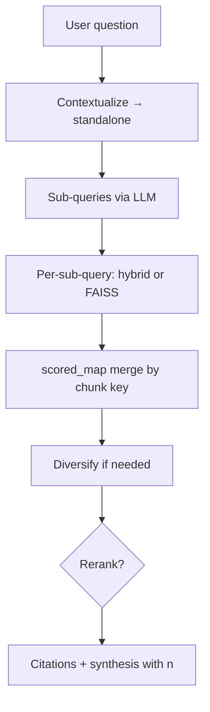

# Co-RAG — `CoRAGService`

Tài liệu mô tả pipeline **decomposition + multi-query retrieval + tổng hợp câu trả lời** trong [`co_rag_service.py`](../app/services/co_rag_service.py). Chế độ này khớp **Answer mode = Co-RAG Only** hoặc cặp so sánh với RAG (`AppConfig.ANSWER_MODE_CO_RAG` / vế Co-RAG trong “RAG & Co-RAG”).

## Ý tưởng so với RAG thuần

| | **RAG** ([RAG.md](./RAG.md)) | **Co-RAG** |
|---|------------------------------|------------|
| Truy vấn retrieve | Một câu (sau tùy chọn rephrase theo lịch sử) | **LLM tách** câu hỏi thành tối đa N **sub-query**; mỗi sub-query gọi retrieve, rồi **gom & khử trùng** chunk. |
| Phù hợp khi | Câu hỏi gọn, intent rõ | Câu hỏi phức tạp, cần nhiều góc từ khóa / ngữ nghĩa khác nhau. |

Cấu hình số sub-query và k mỗi nhánh: `AppConfig.CO_RAG_MAX_SUB_QUERIES`, `CO_RAG_K_PER_SUBQUERY` (và với vector-only, hệ số over-fetch khi cần lọc nguồn — tương tự công thức trong code).

## UI gọi đâu?

[`chat_input.py`](../app/ui/components/chat_input.py): chế độ **Co-RAG Only** → `CoRAGService.get_answer_with_citations`; chế độ **RAG & Co-RAG** gọi song song với `RAGService.get_answer_with_citations`.

## Hai API

### `get_answer_with_citations(query)` — luồng chính (có trích dẫn)

1. **Contextualize** câu hỏi với lịch sử: `_create_contextualize_chain` → `standalone_question` (cùng mô hệ prompt “standalone question” như nhiều RAG LCEL).
2. **Sub-query**: `_generate_subqueries` dùng `_decompose_prompt` + LLM, `_parse_subqueries` giới hạn `CO_RAG_MAX_SUB_QUERIES`, bỏ trùng dòng.
3. **Target sources** (tùy câu): `RAGService._detect_target_sources` — nếu user nhắc tên file, lọc metadata `source` khi gom kết quả.
4. **Với từng sub-query**:
   - Nếu **`retriever_mode == hybrid`** và **không** nhánh `target_sources` lẻ: [`HybridRetrieverService.retrieve`](./HYBRID_RETRIEVER.md) với `k >= max(CO_RAG_K_PER_SUBQUERY, 6)`; cập nhật `scored_map` theo key (source, document_id, chunk_id, char_start), giữ điểm cao hơn.
   - **Ngược lại**: FAISS `similarity_search_with_score` (hoặc tìm kiếm không score), `fetch_k` phụ thuộc `need_overfetch` (filter / target) — tương ứng hệ số trong code; chuẩn hóa relevance `1/(1+dist)`; gom vào cùng `scored_map`.
5. Sắp xếp theo điểm; nếu **không** `target_sources` → `RAGService._diversify_by_source` với `per_source_k` từ session.
6. **Rerank** tùy cờ: `RerankerService.rerank(..., top_k=retrieval_k)` — [RERANK.md](./RERANK.md).
7. `RAGService._docs_to_citations` → context có header `[n]` + nội dung đầy đủ; `_create_synthesis_chain_with_citations` sinh câu trả lời có marker `[n]`.
8. `RAGService._sanitize_answer_citations` → cập nhật lịch sử → `AnswerWithCitations` với `mode` nhãn Co-RAG (`MESSAGE_MODE_CO_RAG` = `"Co-RAG"` trong ứng dụng).

**Chung với RAG:** `RAGService._metadata_filters` / `_passes_filters` (Document Filter trên sidebar).

### `get_answer(query)` — chuỗi LCEL (không pipeline citation UI)

- Retriever: `k = AppConfig.CO_RAG_K_PER_SUBQUERY`.
- Gán `sub_queries` từ `_generate_subqueries(standalone_question)`; `_run_sub_queries` gọi retriever **mỗi** sub-query, merge bằng `_merge_unique_docs` (fingerprint nội dung).
- Tổng hợp bằng `_create_synthesis_chain` (không ép marker `[n]` kiểu citation).
- Bọc `RunnableWithMessageHistory` với `SessionService.get_chat_history`.
- Trả dict `status_code` / `answer` — phục vụ tích hợp/legacy; màn hình chính dùng bản **with_citations** ở trên.

## Cấu hình (`AppConfig`)

- `CO_RAG_MAX_SUB_QUERIES` — tối đa số dòng sub-query.
- `CO_RAG_K_PER_SUBQUERY` — mặc định độ lớn lô retrieve mỗi sub-query (và dùng trong `get_answer` / nhánh FAISS).
- Có thêm `CO_RAG_FALLBACK_K` trong cấu hình ứng dụng; xem thêm trong [`app_config.py`](../app/config/app_config.py) nếu được dùng ở chỗ khác.

## Phụ thuộc RAG dùng lại

- `RAGService._detect_target_sources`, `_metadata_filters`, `_passes_filters`, `_diversify_by_source`, `_docs_to_citations`, `_sanitize_answer_citations`.
- Trích dẫn: [CITATION.md](./CITATION.md).

## Sơ đồ (`get_answer_with_citations`)

## Tài liệu liên quan

| Chủ đề | File |
|--------|------|
| RAG thuần (so sánh) | [RAG.md](./RAG.md) |
| Self-RAG (rewrite + self-eval, khác sub-query) | [SELF_RAG.md](./SELF_RAG.md) |
| Hybrid | [HYBRID_RETRIEVER.md](./HYBRID_RETRIEVER.md) |
| Rerank | [RERANK.md](./RERANK.md) |
| Citation | [CITATION.md](./CITATION.md) |
| Các chế độ trả lời | [ARCHITECTURE.md §8](./ARCHITECTURE.md#8-các-chế-độ-trả-lời-tóm-tắt) |
