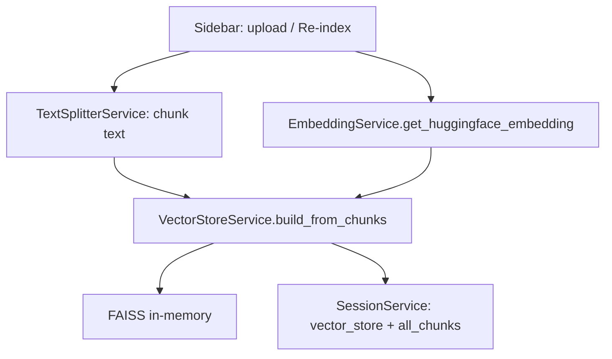

# Embedding — `EmbeddingService` & vector hóa tài liệu

Tài liệu mô tả **cách hệ thống tạo vector embedding** cho chunk văn bản, **cấu hình model**, và **các module gọi embedding** trong pipeline RAG.

## Vai trò trong hệ thống

| Thành phần | Vai trò |
|------------|--------|
| [`EmbeddingService`](../app/services/embedding_service.py) | Cung cấp **một** instance [`HuggingFaceEmbeddings`](https://python.langchain.com/docs/integrations/text_embedding/huggingface) (langchain-huggingface), dùng cho **encode chunk** khi build / cập nhật chỉ mục FAISS. |
| [`AppConfig.EMBEDDING_MODEL_NAME`](../app/config/app_config.py) | ID mô hình **sentence-transformers** (mặc định `paraphrase-multilingual-mpnet-base-v2`) — đa ngôn ngữ, phù hợp tiếng Việt. |
| [`VectorStoreService`](../app/services/vector_store_service.py) | Nhận object `embedding` truyền vào, gọi `FAISS.from_documents(docs, embedding)` (hoặc `add_documents` nếu đã có store). |

Embedding **không** được gọi trực tiếp trong bước trả lời từng câu hỏi theo kiểu “encode question ở đâu?” — **truy vấn** được embed **bên trong** retriever FAISS / pipeline LangChain khi gọi `similarity_search*` trên vector store đã tạo sẵn với cùng `Embeddings` đó (cùng model → cùng không gian vector).

## Cấu hình

- **Model**: `AppConfig.EMBEDDING_MODEL_NAME` trong [`app/config/app_config.py`](../app/config/app_config.py).
- Muốn đổi model khi deploy: có thể sau này chuyển sang `os.getenv("EMBEDDING_MODEL_NAME", ...)` tại `AppConfig` (hiện tại là hằng số trong code).

## `EmbeddingService` — hành vi

```text
get_huggingface_embedding()
  → lần đầu: HuggingFaceEmbeddings(model_name=AppConfig.EMBEDDING_MODEL_NAME)
  → cache class-level (_embedding), các lần sau trả cùng instance
```

- **Singleton (per process)**: tránh tải model nhiều lần khi upload nhiều file hoặc re-index.
- **Phụ thuộc**: `langchain_huggingface`, `sentence-transformers` (và stack torch phía dưới theo version môi trường).

## Luồng dữ liệu (upload → vector)



1. Người dùng upload hoặc bấm Re-index → chunk từ `TextSplitterService`.
2. Lấy `embedding = EmbeddingService.get_huggingface_embedding()`.
3. `VectorStoreService.build_from_chunks(chunks, embedding, metadata=...)` tạo `Document` có `page_content` + metadata (`source`, `document_id`, `chunk_id`, `page`, …).
4. FAISS được lưu trong `st.session_state` qua `SessionService.set_vector_store`; đồng thời mirror chunk cho BM25 qua `SessionService.add_chunks`.

## Dùng ở đâu trong codebase

| Vị trí | Nội dung |
|--------|----------|
| [`app/ui/components/sidebar.py`](../app/ui/components/sidebar.py) | Gọi `get_huggingface_embedding()` trước khi `VectorStoreService.build_from_chunks` (upload mới và `_reindex_all_documents`). |
| [`app/services/vector_store_service.py`](../app/services/vector_store_service.py) | Tham số `embedding` bắt buộc cho `FAISS.from_documents` / `add_documents`. |
| [`app/services/rag_service.py`](../app/services/rag_service.py) | **Không** import `EmbeddingService` — chỉ dùng **vector store đã build** (retrieve). |
| Tests | [`test/test_qa_quality.py`](../test/test_qa_quality.py), [`test/test_doc_processing_performance.py`](../test/test_doc_processing_performance.py), [`test/test_llm_response_time.py`](../test/test_llm_response_time.py) đo thời gian / build store với cùng embedding. |

## Liên quan (không phải embedding thuần)

- **Hybrid retrieval**: BM25 trên text (`SessionService.get_all_chunks`) + vector FAISS — trọng số ở sidebar, logic trong `HybridRetrieverService`.
- **Reranker** (nếu bật): mô hình **CrossEncoder** khác, không thay thế `HuggingFaceEmbeddings` khi index — chi tiết: [RERANK.md](./RERANK.md).

## Gói tóm

| Gói / thư viện | Vai trò với embedding |
|----------------|------------------------|
| **langchain-huggingface** | Bọc `HuggingFaceEmbeddings`. |
| **sentence-transformers** | Tải và chạy mô hình theo `EMBEDDING_MODEL_NAME`. |
| **faiss-cpu** (qua LangChain) | Lưu vector và tìm kiếm L2 / inner product tùy cấu hình. |

Chi tiết **FAISS** và `VectorStoreService` (lưu index, nối, xóa): [VECTOR.md](./VECTOR.md).

Xem tổng thể pipeline: [ARCHITECTURE.md](./ARCHITECTURE.md) (mục embedding & vector store).
