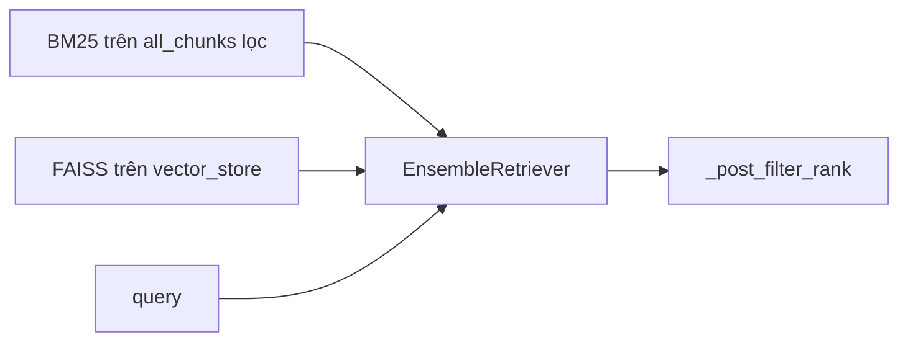

# Hybrid retriever — `HybridRetrieverService`

Tài liệu mô tả **kết hợp tìm theo từ khóa (BM25)** và **tìm theo vector (FAISS / semantic)**, cách **bật** trong UI, và **các service** gọi khi chế độ `hybrid` được chọn.

## Mục đích

- **Chỉ vector** (`vector`): embed câu hỏi rồi tìm gần nhất trong index — tốt cho ngữ nghĩa, đôi khi yếu với từ khóa lặp đúng như tài liệu.
- **Hybrid** (`hybrid`): thêm **BM25** trên cùng tập chunk văn bản, trộn kết quả qua **EnsembleRetriever** (LangChain) với trọng số `w_bm25` / `w_vector = 1 - w_bm25`.

Cả hai “cánh” đều cần dữ liệu đồng bộ từ bước index — xem [CHUNK.md](./CHUNK.md) (`all_chunks` + FAISS) và [VECTOR.md](./VECTOR.md).

## Dữ liệu đầu vào (session)

| Nguồn | Dùng cho |
|--------|-----------|
| `SessionService.get_vector_store()` | Retriever từ **FAISS** (`as_retriever`, `k = max(2k, 10)` với tham số `k` của lệnh gọi). |
| `SessionService.get_all_chunks()` | **BM25Retriever.from_documents** — index từ **toàn bộ** `Document` đã nối qua từng lần `build_from_chunks` (trong bộ nhớ, build lại mỗi lần `retrieve` / per sub-query tùy flow). |

**Lọc tài liệu:** `doc_filter` (theo tên nguồn) và `type_filter` (theo `file_type` trong metadata) — mặc định lấy từ `SessionService` nếu caller không truyền. Chunk được lọc trước khi tạo BM25.

**Trọng số BM25:** `SessionService.get_bm25_weight()` (0..1) khi `bm25_weight` không truyền; vector nhận `1 - bm25_weight`. Cấu hình ở sidebar khi chọn chế độ hybrid (`AppConfig.RETRIEVER_MODE_HYBRID` = `"hybrid"`).

## Luồng `retrieve(query, k=10, …)`

1. Lấy `vector_store`, `all_chunks`, filter, `bm25_weight`.
2. Nếu **không có cả** vector store **và** chunks → trả về rỗng.
3. Lọc chunks theo filter → `filtered_chunks`.
4. Tạo **BM25Retriever** từ `filtered_chunks` (nếu có), đặt `bm25.k = max(k * 2, 10)`.
5. Tạo **retriever từ FAISS** (nếu có), `search_kwargs["k"] = max(k * 2, 10)`.
6. Một retriever: chỉ gọi retriever đó, rồi `_post_filter_rank`.
7. Hai retriever: `EnsembleRetriever(retrievers, weights=...)`, `invoke(query)`, rồi `_post_filter_rank`.
8. **Fallback**
   - Không import được `BM25Retriever` từ langchain → `_vector_only`.
   - `EnsembleRetriever` lỗi → `_vector_only`.

`_vector_only` dùng `similarity_search_with_score` (hoặc bỏ score), `fetch_k` lớn hơn khi có filter (`k * 5`), chuẩn hóa relevance `1 / (1 + dist)`.

## Hậu xử lý: `_post_filter_rank`

- **Dedup** theo key (source, document_id, chunk_id, char_start, prefix 60 ký tự nội dung) để tránh trùng từ hai nguồn.
- **Điểm 0..1** theo thứ tự rank sau hợp nhất: rank 1 ≈ 1.0, suy giảm tuyến tính theo `k` (hệ số 0.6 trong công thức) — dùng thống nhất với pipeline **citation** (điểm liên quan gần đúng).

Số `k` trả về tối đa là tham số `k` gọi `retrieve` (sau khi cắt).

## Ai gọi `HybridRetrieverService`?

Khi `SessionService.get_retriever_mode() == "hybrid"` (thường so sánh với `AppConfig.RETRIEVER_MODE_HYBRID`):

| Module | Cách dùng |
|--------|------------|
| [`rag_service.py`](../app/services/rag_service.py) | Nhánh retrieve trong `get_answer_with_citations`: `fetch_k` có thể lớn hơn nếu bật rerank; sau đó có thể `RerankerService` — [RERANK.md](./RERANK.md). |
| [`co_rag_service.py`](../app/services/co_rag_service.py) | Từng sub-query, **khi** `hybrid` **và** không đang dùng nhánh ưu tiên `target_sources` theo tên file (nhánh kia dùng FAISS/vector theo từng nguồn). `k` tối thiểu 6 ở một chỗ nếu cần. |
| [`self_rag_service.py`](../app/services/self_rag_service.py) | Trong `_retrieve`: hybrid hoặc vector-only, rồi diversify, rerank tùy cờ. |

Khi chế độ **vector** (không hybrid), các file trên dùng `RAGService._score_docs` / FAISS trực tiếp thay vì `HybridRetrieverService`.

## Bật trên giao diện

- Sidebar → **Chunk & Retrieval** → **Retriever mode** = `hybrid` (các giá trị: `AppConfig.RETRIEVER_MODE_OPTIONS`).
- khi chọn `hybrid`, hiện thêm **BM25 weight** (0..1) — lưu `bm25_weight` trong session.

## Thư viện

- **langchain_community** `BM25Retriever` (fallback import từ `langchain.retrievers` nếu cần).
- **EnsembleRetriever** từ `langchain.retrievers`.
- **rank_bm25** (gói phụ thuộc BM25) — thông qua LangChain.
- Từ khóa yêu cầu 8.2.7 trong comment module.

## Sơ đồ (rút gọn)

## Tài liệu liên quan

- [CHUNK.md](./CHUNK.md) — `all_chunks` là gì, vì sao cần cho BM25.
- [VECTOR.md](./VECTOR.md) — FAISS, `VectorStoreService`.
- [RERANK.md](./RERANK.md) — bước tùy chọn sau hybrid.
- [ARCHITECTURE.md §6](./ARCHITECTURE.md#6-truy-vấn-retrieval) — bảng tổng hợp.
