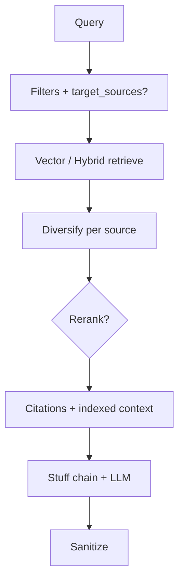

# RAG — `RAGService` (RAG Only)

Tài liệu mô tả **pipeline RAG “thuần”** trong [`rag_service.py`](../app/services/rag_service.py): truy hồi từ vector store (và tùy chọn hybrid / rerank), **trích dẫn inline `[n]`**, và **hai lối vào** (`get_answer` vs `get_answer_with_citations`). Chế độ này khớp **Answer mode = RAG Only** trên UI (`AppConfig.ANSWER_MODE_RAG`).

## UI gọi đâu?

[`chat_input.py`](../app/ui/components/chat_input.py): khi `answer_mode` là RAG Only (hoặc chế độ “cả hai” sẽ gọi thêm Co-RAG song song), nó gọi:

`RAGService.get_answer_with_citations(user_input)` → trả về `AnswerWithCitations` → lưu qua `SessionService.add_message_with_citations`.

`get_answer(...)` trả dict `status_code` / `answer` **không** được UI chính dùng hiện tại; giữ như **chuỗi RAG cổ điển** (retrieval chain + history) cho tích hợp hoặc test.

## Hai API

### `get_answer_with_citations(query)` — luồng chính

1. **Điều kiện**: query không rỗng; có `vector_store` trong session.
2. **Tham số retrieval** (sidebar / session): `k` = `retrieval_k`, `per_source_k` = giới hạn chunk mỗi file (`SessionService.get_retrieval_params()`).
3. **Rerank**: nếu `use_reranker` → tăng `fetch_k` (`AppConfig.RERANK_CANDIDATE_MULTIPLIER`, `RERANK_CANDIDATE_MIN`) trước khi cắt lại — [RERANK.md](./RERANK.md).
4. **Target sources** (`_detect_target_sources`): nếu câu hỏi nhắc tên file đã upload → gọi `_score_docs` **theo từng** `filter_source` với `k = per_source`, gom và sort.
5. **Không** target source:
   - `retriever_mode == hybrid` → [`HybridRetrieverService.retrieve`](./HYBRID_RETRIEVER.md) rồi `_diversify_by_source`;
   - ngược lại → `_score_docs` trên FAISS rồi `_diversify_by_source`.
6. **Rerank** (nếu bật): `RerankerService.rerank(..., top_k=k)`.
7. **`_docs_to_citations`**: `Document` + điểm → danh sách [`Citation`](./CITATION.md) (excerpt, `ref_index`, …).
8. **`_build_indexed_context`**: gói lại context có prefix `[n]` + nguồn cho LLM.
9. **`_create_document_chain()`** (`create_stuff_documents_chain`): prompt bắt buộc trả lời **chỉ** từ context và gắn marker `[n]` đúng block.
10. **`_sanitize_answer_citations`**: làm sạch marker không hợp lệ, remap số citation theo câu trả lời thực tế.
11. Cập nhật **ChatMessageHistory** (user + assistant).
12. Trả về `AnswerWithCitations` với `mode=AppConfig.MESSAGE_MODE_RAG` (chuỗi `"RAG"`).

**Lọc tài liệu:** `_metadata_filters` + `_passes_filters` dùng `doc_filter` và `file_type_filter` từ session (sidebar **Document Filter**).

### `get_answer(query)` — chuỗi LangChain “full retrieval”

- `as_retriever(search_kwargs={"k": AppConfig.LEGACY_RAG_CHAIN_RETRIEVER_K})`
- `create_history_aware_retriever` + `create_retrieval_chain` + `RunnableWithMessageHistory`
- **Không** đi qua pipeline citation tùy chỉnh ở trên; phù hợp demo hoặc API trả text thuần.

## Thành phần kỹ thuật chính

| Thành phần | Vai trò |
|------------|--------|
| `AIConfig.get_llm_instance()` | LLM (Ollama / Groq) — [ai_config.py](../app/config/ai_config.py). |
| `_score_docs` | FAISS `similarity_search_with_score`, lọc filter, over-fetch khi cần (`RETRIEVAL_OVERFETCH_*`). |
| `_diversify_by_source` | Giới hạn số chunk mỗi `source` để nhiều tài liệu cùng xuất hiện. |
| `_sanitize_answer_citations` | Đồng bộ marker `[n]` với `Citation.ref_index`. |

## Sơ đồ (get_answer_with_citations)

## Cấu hình liên quan (`AppConfig`)

- `MESSAGE_MODE_RAG`, `DEFAULT_RETRIEVAL_K`, `RETRIEVAL_OVERFETCH_*`, `RERANK_CANDIDATE_*`, `LEGACY_RAG_CHAIN_RETRIEVER_K`, `CITATION_EXCERPT_MAX_LEN`, v.v. — xem [`app_config.py`](../app/config/app_config.py).

## Tài liệu liên quan

| Chủ đề | File |
|--------|------|
| Trích dẫn, `Citation` | [CITATION.md](./CITATION.md) |
| Vector store / FAISS | [VECTOR.md](./VECTOR.md) |
| Hybrid BM25 + vector | [HYBRID_RETRIEVER.md](./HYBRID_RETRIEVER.md) |
| Rerank cross-encoder | [RERANK.md](./RERANK.md) |
| Co-RAG (sub-query, so sánh) | [CO_RAG.md](./CO_RAG.md) |
| Self-RAG (rewrite, self-eval, hops) | [SELF_RAG.md](./SELF_RAG.md) |
| Chế độ trả lời (RAG / Co-RAG / …) | [ARCHITECTURE.md §8](./ARCHITECTURE.md#8-các-chế-độ-trả-lời-tóm-tắt) |
