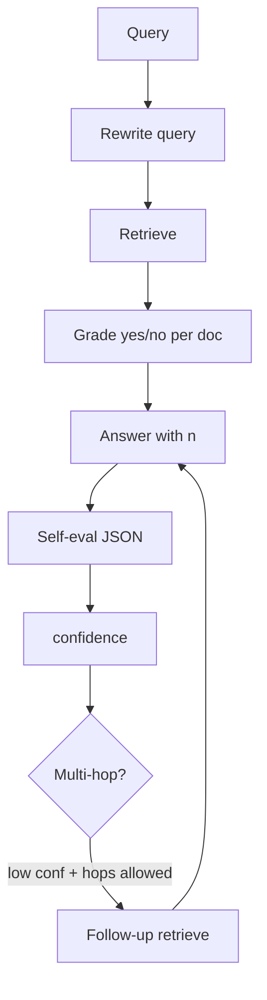

# Self-RAG — `SelfRAGService`

Tài liệu mô tả pipeline **viết lại câu hỏi → truy hồi → chấm relevance từng chunk → trả lời có `[n]` → tự đánh giá (grounded / completeness) → tùy chọn vòng bổ sung (multi-hop)** trong [`self_rag_service.py`](../app/services/self_rag_service.py). Khớp **Answer mode = Self-RAG** (`AppConfig.ANSWER_MODE_SELF_RAG` / `MESSAGE_MODE_SELF_RAG` = `"Self-RAG"`).

## Ý tưởng (tóm tắt theo module docstring 8.2.10)

1. **Query rewriting** — LLM diễn đạt lại câu hỏi cho dễ retrieve (giữ nguyên ngôn ngữ).
2. **Retrieve** — vector hoặc hybrid + diversify + rerank tùy cấu hình session ([HYBRID_RETRIEVER.md](./HYBRID_RETRIEVER.md), [RERANK.md](./RERANK.md)).
3. **Relevance grade** — từng ứng viên: LLM trả lời `yes` / `no` (xem nội dung có liên quan câu hỏi không). Passage gửi grader bị cắt ngắn (trong code ~**1500** ký tự đầu; `AppConfig.SELF_RAG_PASSAGE_MAX_CHARS` khớp giá trị này).
4. **Answer** — context đã gắn `[n]`; prompt giống tinh thần RAG/Co-RAG (chỉ dùng nguồn, marker đúng block).
5. **Self-evaluation** — LLM trả **JSON** `grounded`, `completeness` ∈ [0,1]; parse lỏng + fallback số nếu model lệch format.
6. **Confidence** — kết hợp điểm self-eval với **mean relevance** trên chunk còn lại:  
   `confidence = (grounded + completeness) / 2 * (SELF_RAG_CONFIDENCE_MEAN_REL_BASE + SELF_RAG_CONFIDENCE_MEAN_REL_SCALE * mean_rel)` (hệ số 0.5+0.5*mean_rel trong code).
7. **Multi-hop (hop 2)** — nếu `confidence < SELF_RAG_CONFIDENCE_THRESHOLD` và `SELF_RAG_MAX_HOPS > 1`: sinh **một** câu hỏi phụ (`_followup_chain`), retrieve + grade bổ sung, **merge** chunk mới (trùng key bỏ qua), trả lời lại, self-eval lại, `hops = 2`. Lỗi ở bước refine → giữ câu trả lời hop 1.

**An toàn:** nếu grader **loại hết** chunk, lấy **top 3** ứng viên theo điểm gốc (`SELF_RAG_IRRELEVANT_FALLBACK_TOP_K`).

## `AnswerWithCitations` bổ sung

So với RAG/Co-RAG, response có thêm (khi thành công):

- `confidence`, `grounded_score`, `completeness_score`, `hops`
- `rewritten_query` nếu khác câu hỏi gốc

Xem [CITATION.md](./CITATION.md) về `AnswerWithCitations`.

## Hàm chính: `get_answer_with_citations`

- Dùng `RAGService._docs_to_citations`, `_build_indexed_context` (dạng string ghép), `_sanitize_answer_citations`.
- `_retrieve` ủy quyền: hybrid hoặc `RAGService._score_docs`, `fetch_k` lớn hơn khi bật rerank (`max(k*3, 15)` trong code; khác công thức tham số ở [RAG.md](./RAG.md) — tùy pipeline).

**Lưu ý:** Self-RAG **không** dùng `_create_contextualize_chain` kiểu Co-RAG; **không** tách sub-query. Viết lại câu là **một** bước `_query_rewrite_chain`.

## UI

[`chat_input.py`](../app/ui/components/chat_input.py) — mode Self-RAG gọi `SelfRAGService.get_answer_with_citations`, lưu thêm trường `confidence`, `rewritten_query`, … nếu có. [`chat_display.py`](../app/ui/components/chat_display.py) có thể hiển thị confidence (theo code UI hiện tại).

## Cấu hình (`AppConfig`)

- `SELF_RAG_CONFIDENCE_THRESHOLD` — ngưỡng kích hoạt nhánh follow-up.
- `SELF_RAG_MAX_HOPS` — tối đa 2 vòng theo thiết kế hiện tại.
- `SELF_RAG_PASSAGE_MAX_CHARS`, `SELF_RAG_EVAL_FALLBACK_SCORE`, `SELF_RAG_IRRELEVANT_FALLBACK_TOP_K`, `SELF_RAG_CONFIDENCE_MEAN_REL_*` — xem [`app_config.py`](../app/config/app_config.py).

## Sơ đồ (rút gọn)

## So sánh nhanh

| | [RAG.md](./RAG.md) | [CO_RAG.md](./CO_RAG.md) | Self-RAG |
|---|--------------------|-------------------------|----------|
| Truy hỏi / nhiều query | 1 ( + filter) | Nhiều sub-query | 1 câu đã viết lại; hop 2 thêm 1 follow-up |
| Lọc sau retrieve | Diversify, rerank | Gom map + … | **LLM yes/no** từng doc |
| Sau câu trả lời | — | — | **JSON** self-eval + confidence |

## Tài liệu liên quan

- [RAG.md](./RAG.md), [CO_RAG.md](./CO_RAG.md) — các chế độ khác.
- [HYBRID_RETRIEVER.md](./HYBRID_RETRIEVER.md), [RERANK.md](./RERANK.md) — tầng retrieve trong `_retrieve`.
- [CITATION.md](./CITATION.md) — `Citation` / `AnswerWithCitations`.
- [ARCHITECTURE.md §8](./ARCHITECTURE.md#8-các-chế-độ-trả-lời-tóm-tắt) — tổng quan chế độ.
