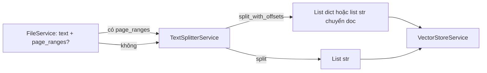

# TextSplitter — `TextSplitterService`

Tài liệu mô tả **cách chia văn bản thành chunk**, **thông số `chunk_size` / `chunk_overlap`**, và **nơi gọi** trong ứng dụng.

## Vai trò

[`TextSplitterService`](../app/services/text_splitter_service.py) bọc [`RecursiveCharacterTextSplitter`](https://python.langchain.com/docs/modules/data_connection/document_transformers/recursive_text_splitter) (**langchain-text-splitters**): cắt văn bản dài thành các đoạn có kích thước ký tự gần đúng (`chunk_size`), với **phần chồng lấn** (`chunk_overlap`) giữa hai chunk liên tiếp để không mất ngữ cảnh ở ranh giới.

Chunk là **đơn vị** sau đó được:

1. Đưa vào [`VectorStoreService.build_from_chunks`](../app/services/vector_store_service.py) → embed + FAISS;
2. Lưu mirror trong `SessionService.all_chunks` phục vụ BM25 (hybrid).

## Thông số: `AppConfig` vs session

| Nguồn | Khi nào dùng |
|--------|----------------|
| **Session** (`chunk_size`, `chunk_overlap`) | Người dùng chỉnh slider ở sidebar **Chunk & Retrieval**; `SessionService.get_chunk_params()` đọc các giá trị này. |
| **`AppConfig`** | Mặc định khi chưa có session hoặc lỗi đọc: `CHUNK_SIZE`, `CHUNK_OVERLAP` (và các biên slider như `CHUNK_SLIDER_MIN` / `MAX` trong cấu hình UI). |

Hàm nội bộ `_resolve_params()` luôn trả `(chunk_size, chunk_overlap)` theo thứ tự ưu tiên trên.

## Cấu hình splitter

- **`separators`**: `["\n\n", "\n", ". ", " ", ""]` — ưu tiên tách theo đoạn, dòng, câu, rồi khoảng trắng.
- **An toàn nếu overlap ≥ size**: tự giảm overlap xuống `max(0, chunk_size // 5)` (tránh cấu hình không hợp lệ). Có hằng tương ứng trong `AppConfig`: `CHUNK_OVERLAP_AUTO_DIVISOR` (giá trị 5) — dùng khi cần đồng bộ tài liệu / refactor.

## Hai API công khai

### `split(text) -> List[str]`

- Trả về **chỉ** danh sách chuỗi chunk, không offset/trang.
- Dùng khi **không** có `page_ranges` từ bước trích xuất (ví dụ nguồn không cần map trang theo ký tự).

### `split_with_offsets(text, page_ranges=None) -> List[dict]`

Mỗi phần tử:

```text
{ "text": str, "start": int, "end": int, "page": int | None }
```

- Bật `add_start_index=True` trên `RecursiveCharacterTextSplitter` → metadata `start_index` → suy `start` / `end` ([start, end) theo ký tự trong full text đã nối).
- **`page_ranges`**: từ [`FileService`](../app/services/file_service.py) (PDF nhiều trang) — list `{page, start, end}`. Hàm `_locate_page` gán **một** số trang cho chunk: trang có **độ phủ ký tự lớn nhất** giao với khoảng `[start, end)`.

Khi `page_ranges` rỗng / `None`, `page` là `None` (vẫn có offset nếu dùng mode offsets).

## Luồng gọi trong ứng dụng



- [`app/ui/components/sidebar.py`](../app/ui/components/sidebar.py): upload tài liệu và **Re-index** — nếu metadata có `page_ranges` thì `split_with_offsets`, ngược lại `split`, rồi truyền kết quả cho `build_from_chunks`.

## Tests & tiện ích

| File | Cách dùng |
|------|------------|
| `test/test_qa_quality.py` | `TextSplitterService.split` trên text đã trích. |
| `test/test_doc_processing_performance.py` | `split` đo hiệu năng chunk. |
| `test/test_llm_response_time.py` | `split` trước khi build vector. |

## Liên quan

- **Cấu hình UI** chunk: sidebar cùng `AppConfig` (margin overlap, bước slider) — xem [ARCHITECTURE.md §4](./ARCHITECTURE.md#4-chunk-và-metadata).
- **Sau khi chunk**: [EMBEDDING.md](./EMBEDDING.md) (embed + FAISS).
- Trích dẫn theo `chunk_id` / trang: [CITATION.md](./CITATION.md).
