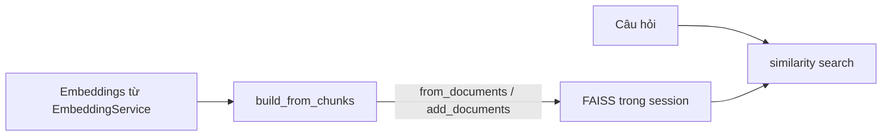

# Vector store — FAISS & `VectorStoreService`

Tài liệu mô tả **lưu trữ vector** (chỉ mục ngữ nghĩa), **lớp `VectorStoreService`**, hành vi **nối / tạo lại FAISS**, và **các service đọc vector store** khi truy vấn.

## Vai trò tách với “embedding thuần”

| Khái niệm | Nội dung |
|----------|----------|
| **Embedding** | Hàm/mô hình chuyển text → vector (một số chiều cố định). Trong app: [`EmbeddingService`](../app/services/embedding_service.py) + `AppConfig.EMBEDDING_MODEL_NAME` — xem [EMBEDDING.md](./EMBEDDING.md). |
| **Vector store** | Cấu trúc dữ liệu lưu **nhiều vector + mapping về** `Document` (LangChain) để **tìm kiếm tương tự** theo câu hỏi. Ở đây: **FAISS** trong RAM, gắn với phiên Streamlit. |

Một **vector** trong index = embedding của nội dung `page_content` một chunk, kèm metadata (nguồn, trang, offset, `chunk_id`, …) — tổng quan dữ liệu chunk: [CHUNK.md](./CHUNK.md).

## Thư viện

- **`langchain_community.vectorstores.FAISS`**: tạo index từ `Document` + `Embeddings`.
- **`faiss-cpu`**: backend tìm kiếm gần đúng (L2/inner product tùy cấu hình LangChain mặc định cho encoder đã dùng).

Dữ liệu **chỉ tồn tại bộ nhớ** theo `st.session_state` — **không** persist ra đĩa; reload app = mất index (cần upload / re-index lại).

## `VectorStoreService` — API

| Phương thức | Hành vi |
|-------------|---------|
| `build_from_chunks(chunks, embedding, metadata=None)` | Chuyển `chunks` thành `List[Document]`, rồi cập nhật FAISS; luôn gọi `SessionService.add_chunks(docs)` để sync danh sách phục vụ BM25. |
| `get_vector_store()` | Ủy quyền `SessionService.get_vector_store()`. |
| `clear()` | `clear_vector_store` + `clear_all_chunks` (xóa cả bản mirror cho hybrid). |

### `build_from_chunks` — nối với FAISS đã có

1. Nếu **chưa có** `vector_store` → `FAISS.from_documents(docs, embedding)`.
2. Nếu **đã có**:
   - Thử `existing.add_documents(docs)`.
   - Nếu **lỗi** (nhiều phiên bản LangChain/định dạng) → log exception và **tạo mới** `FAISS.from_documents(docs, embedding)` từ **chỉ batch hiện tại** (có thể mất tích hợp với index cũ — trường hợp hãn).

Luôn: `set_vector_store(vector_store)` + `add_chunks` sau khi build.

**Đầu vào `chunks`:** `List[str]` hoặc `List[dict]` (chi tiết: [CHUNK.md](./CHUNK.md)).

**Tham số `embedding`:** cùng instance `HuggingFaceEmbeddings` với mọi lần gọi trong phiên, để cùng không gian vector khi tìm kiếm.

## Ai dùng vector store khi trả lời?

Các service gọi **`SessionService.get_vector_store()`** (không bắt buộc qua `VectorStoreService`):

| Module | Mục đích |
|--------|----------|
| [`rag_service.py`](../app/services/rag_service.py) | `similarity_search_with_score` / truy hồi context cho câu trả lời có trích dẫn. |
| [`co_rag_service.py`](../app/services/co_rag_service.py) | Truy hồi theo từng sub-query, gom kết quả. |
| [`self_rag_service.py`](../app/services/self_rag_service.py) | Cùng tầng retrieve sau khi viết lại câu hỏi. |
| [`hybrid_retriever_service.py`](../app/services/hybrid_retriever_service.py) | Một “cánh” ensemble: FAISS + BM25; FAISS lấy từ session. |

## Nơi tạo / xóa index (UI & luồng)

| Sự kiện | Hành động |
|---------|-----------|
| Upload tài liệu / thêm file | [`sidebar`](../app/ui/components/sidebar.py) → `build_from_chunks` sau khi `TextSplitterService` tạo chunk. |
| Re-index tất cả | `VectorStoreService.clear` rồi build lại từ toàn bộ tài liệu trong session. |
| Clear Vector Store (Danger Zone) | `VectorStoreService.clear` → xóa FAISS + `all_chunks`. |

## Sơ đồ (embed → lưu → truy vấn)

## Tài liệu liên quan

- [EMBEDDING.md](./EMBEDDING.md) — model nhúng, singleton `HuggingFaceEmbeddings`.
- [CHUNK.md](./CHUNK.md) — chunk, metadata, `all_chunks`.
- [HYBRID_RETRIEVER.md](./HYBRID_RETRIEVER.md) — BM25 + FAISS qua `EnsembleRetriever` (khi chế độ `hybrid`).
- [RERANK.md](./RERANK.md) — sắp lại ứng viên bằng cross-encoder (sau FAISS/hybrid).
- [ARCHITECTURE.md §5–6](./ARCHITECTURE.md#5-embedding-và-vector-store) — tóm tắt embedding, vector DB, retrieval.
